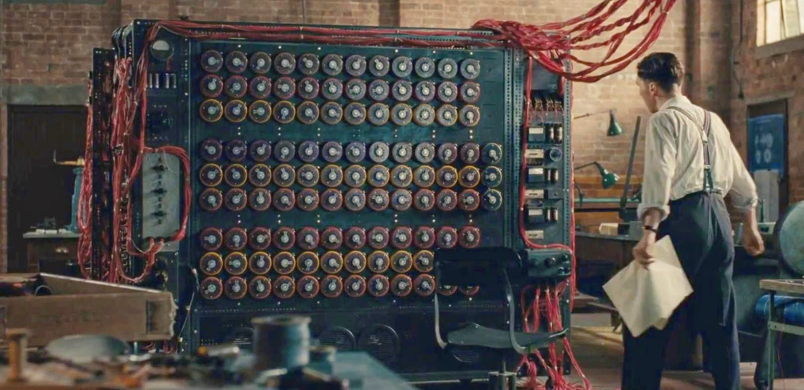
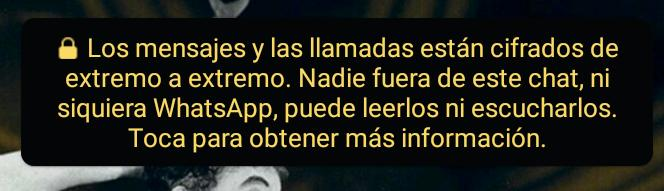
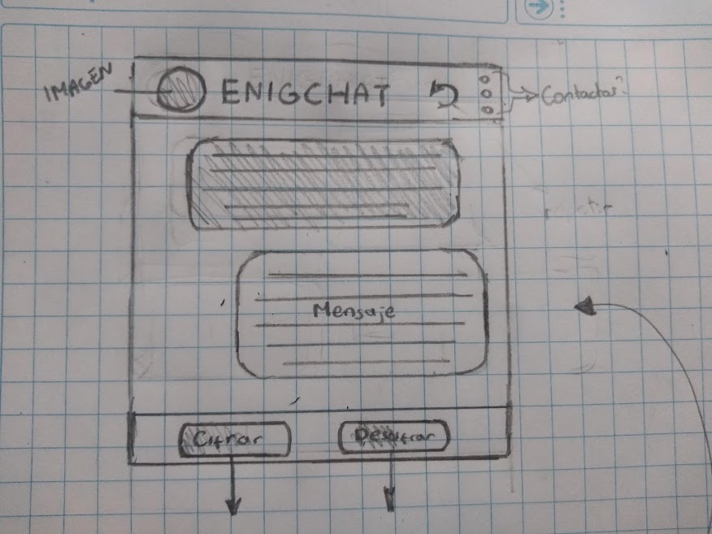
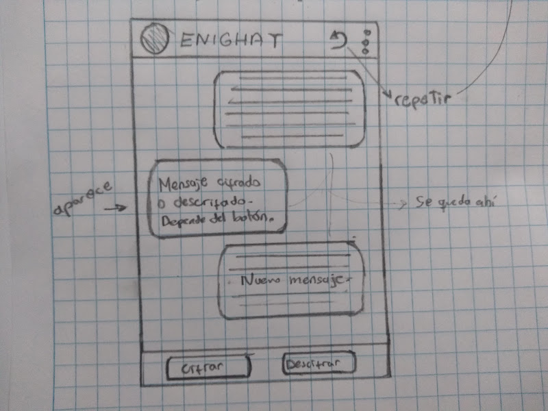
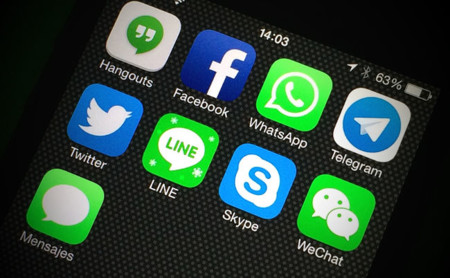
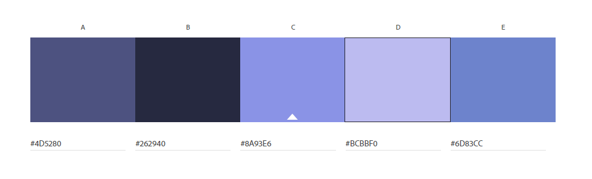

# Cifrado César

## 1. Idea

En un principio no tenía claro qué temática usar para la aplicación web. Lo único que se me venía a la mente era la película El código enigma (The Imitation Game). Ahí mostraban cómo un matemático logró crear una máquina, que descifraba mensajes secretos de los nazis, para poder ganar la guerra.

¿Cómo poner todo eso en una app? ¿Entenderán que es una referencia ? ¿Tengo que explicar todo lo anterior en la web?. Todas esas preguntas llenaron mi cabeza, así que decidí solo quedarme con lo escencial. Recibir y mandar mensajes. Pero ¿cómo llevarlo a un contexto actual?.Mensajería instantánea. Whatsapp, Telegram, Signal y muchas más aplican el sistema de cifrar mensajes por nuestra seguridad.

Así que pensé, ¿por qué no hago la mía?. Es así como nace EnigmaChat.

## 2. Propuesta

La aplicación que encriptará los mensajes que quieras, para que los mandes a cualquiera.
Estos son los bocetos que realicé

En cuanto a la paleta de color noté que la mayoría de aplicaciones de mensajería usan demasiado los tonos azules y verdes fríos.

Así que para destacarme pero, a su vez, no ser demasiado ajena a lo que el público está acostumbrado, opté por el color morado.

Manteniene lo sobrio y frío pero también se distingue del resto. Además es un color familiar que invita al público a usarla.

## 3. Aplición

